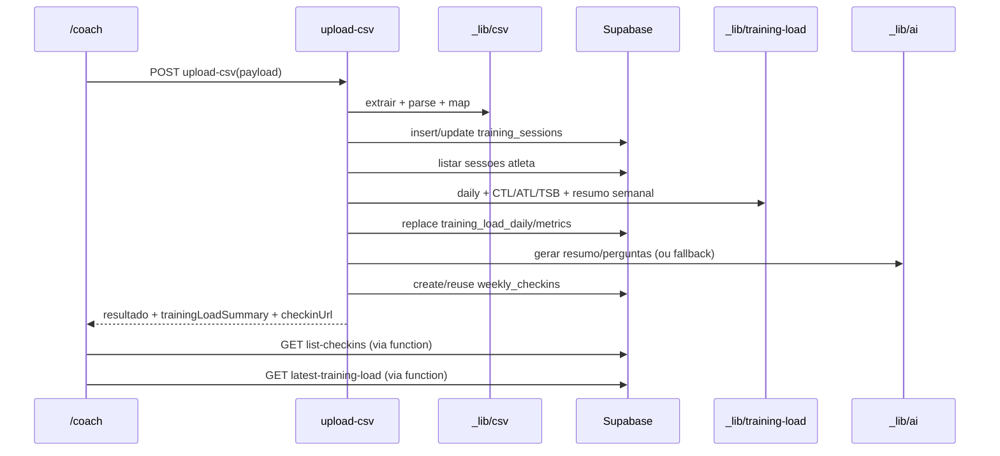

# Fluxo Completo: Upload de Dados de Treino -> Visualizacao em /coach

Este documento descreve, ponta a ponta, como os dados de treino entram no sistema (upload no painel de coach), como sao processados no backend e como sao apresentados no ecrã `/coach`.

## 1) Vista geral do fluxo

1. O coach abre `/coach`, escolhe (ou cria) um atleta e faz upload de um ficheiro `.csv`, `.gz` ou `.zip`.
2. O frontend envia o payload para `/.netlify/functions/upload-csv` com:
   - identificador do atleta
   - conteudo do ficheiro (texto CSV ou base64 comprimido)
  - `skipCheckin=true` quando o objetivo e importar sem gerar check-in
  - quando `skipCheckin=false` ou omitido, confirmacao manual de forca (`strengthPlannedDoneCount`, `strengthPlannedNotDoneCount`, feedback opcional)
3. A funcao `upload-csv`:
   - extrai e parseia os dados
   - normaliza e classifica cada sessao
   - faz deduplicacao por chave de sessao
   - insere/atualiza sessoes na tabela `training_sessions`
   - recalcula carga diaria e metricas CTL/ATL/TSB
  - cria (ou reutiliza) o check-in semanal na tabela `weekly_checkins`, exceto quando `skipCheckin=true`
4. O frontend mostra imediatamente no `/coach`:
   - resumo do upload
   - resumo de carga semanal (CTL/ATL/TSB, duracao, TSS, distancia corrida, trabalho)
   - link para check-in
5. O ecrã `/coach` tambem consome endpoints dedicados para:
   - lista de check-ins por atleta
   - carga mais recente por atleta
   - cancelamento de batch de upload

## 2) Frontend /coach: de onde vem cada acao

O ficheiro `coach/index.html` faz as chamadas abaixo:

- `GET /.netlify/functions/list-athletes`
  - preenche o dropdown de atletas
- `POST /.netlify/functions/create-athlete`
  - cria atleta e faz refresh da lista
- `POST /.netlify/functions/upload-csv`
  - processa upload de treino
- `GET /.netlify/functions/list-checkins?athleteId=...`
  - lista check-ins do atleta selecionado
- `GET /.netlify/functions/latest-training-load?athleteId=...`
  - carrega o resumo de carga mais recente
- `POST /.netlify/functions/cancel-upload`
  - remove sessoes + check-in do batch (quando ainda cancelavel)

### 2.1 Payload enviado no upload

O submit do formulario constrói um payload com:

- `athleteId` (obrigatorio)
- `sourceFileName` (nome do ficheiro)
- um destes campos de conteudo:
  - `csvText` (quando e CSV plain text)
  - `gzBase64` (quando termina em `.gz`)
  - `zipBase64` (quando termina em `.zip`)
- `strengthPlannedDoneCount` (inteiro >= 0, obrigatorio)
- `strengthPlannedNotDoneCount` (inteiro >= 0, obrigatorio)
- `manualStrengthFeedback` (texto opcional)
- `skipCheckin` (booleano opcional)

Se `skipCheckin=false`, os contadores de forca invalidos bloqueiam o envio. Se `skipCheckin=true`, o upload segue sem criar check-in.

## 3) Endpoint principal: upload-csv

### 3.1 Validacoes iniciais

A funcao `netlify/functions/upload-csv.js` valida:

- metodo HTTP tem de ser `POST`
- `athleteId` obrigatorio
- se `skipCheckin=false`, `strengthPlannedDoneCount` e `strengthPlannedNotDoneCount` tem de ser inteiros nao negativos
- tem de existir conteudo em `csvText`, `gzBase64` ou `zipBase64`

### 3.2 Batch ID (idempotencia por ficheiro)

O `uploadBatchId` e derivado em `netlify/functions/_lib/upload-batch.js`:

1. Se vier `uploadBatchId` valido (UUID), usa esse.
2. Senao, tenta derivar a partir de `sourceFileName` (sem extensao).
3. Se o nome ja for UUID, usa diretamente.
4. Caso contrario, gera UUID deterministicamente por hash (`athleteId|fileStem`).

Resultado: repetir upload do mesmo ficheiro para o mesmo atleta tende a reaproveitar o mesmo batch.

### 3.3 Extracao e parse do ficheiro

A biblioteca `netlify/functions/_lib/csv.js`:

- deteta delimitador (`;` vs `,`)
- suporta CSV com quotes e escape `""`
- descomprime:
  - GZip (`gzBase64`)
  - ZIP (`zipBase64`) e escolhe o primeiro `.csv` (ou primeiro ficheiro)
- mapeia colunas comuns do export do TrainingPeaks para um objeto interno de sessao

### 3.4 Normalizacao e classificacao da sessao

Cada linha valida e convertida em sessao com campos como:

- `session_date`, `title`, `sport_type`
- planeado vs realizado (`planned_duration_minutes`, `actual_duration_minutes`, etc.)
- metricas (`tss`, `intensity_factor`, `work_kj`, `distance_km`, ...)
- `execution_status` e `execution_ratio`

Estados de execucao usados:

- `ignored_empty_row`
- `done_not_planned`
- `planned_not_done`
- `planned_partially_done`
- `planned_done`

### 3.5 Deduplicacao e persistencia

A funcao procura sessoes existentes por chave:

- `(session_date, title, sport_type)` para o atleta

Com isso:

- sessoes novas -> `insertTrainingSessions` (insert)
- sessoes existentes -> `updateSessionResults` (patch de metricas)

Isto evita duplicados e permite corrigir dados de sessoes ja importadas.

### 3.6 Recalculo da carga de treino

Depois de inserir/atualizar sessoes:

1. carrega todas as sessoes do atleta (`listTrainingSessionsForAthlete`)
2. agrega por dia (`aggregateTrainingLoadDaily`)
3. calcula CTL/ATL/TSB ao longo do tempo (`calculateTrainingLoadMetrics`)
4. substitui integralmente:
   - `training_load_daily`
   - `training_load_metrics`
5. gera `trainingLoadSummary` da semana do upload (`summarizeTrainingLoadWeek`)

Notas de calculo:

- CTL usa constante temporal 42 dias
- ATL usa constante temporal 7 dias
- TSB = CTL - ATL

### 3.7 Criacao/reutilizacao de check-in semanal

Se `skipCheckin=true`, esta fase e ignorada:

- nao ha geracao de perguntas AI
- nao ha token publico
- nao ha escrita em `weekly_checkins`
- o upload serve apenas para atualizar sessoes e recalcular carga

A funcao tenta obter check-in por `(athleteId, uploadBatchId)`:

- se existir, reutiliza (`reusedCheckin = true`)
- se nao existir, cria novo check-in:
  - semana (`week_start`)
  - sumario + perguntas AI (`generateWeeklyQuestions`)
  - token unico para URL publica de check-in
  - confirmacao manual de forca guardada no registo

Se o batch existir sem confirmacao manual de forca, devolve `409` para forcar reimportacao correta.

### 3.8 Resposta devolvida ao frontend

O `upload-csv` devolve, entre outros:

- `uploadBatchId`
- `skipCheckin`
- contadores `imported`, `updated`, `total`
- `weekStart`, `weekEnd`
- `trainingLoadSummary`
- `executionSummary`
- estado de reutilizacao de check-in
- dados finais de confirmacao de forca
- `checkinUrl` (nulo quando `skipCheckin=true`)

O frontend usa esta resposta para atualizar UI e mensagens de sucesso.

## 4) Como os dados sao mostrados no /coach

## 4.1 Lista de check-ins

Endpoint: `GET /.netlify/functions/list-checkins?athleteId=...`

- Le da tabela `weekly_checkins` (ultimos 50, por `week_start desc`)
- Acrescenta `checkinUrl` montada com `SITE_URL` + token
- O frontend renderiza cards com:
  - semana
  - status
  - resumo (`training_summary`)
  - confirmacao manual de forca
  - botao de cancelar (quando permitido)

## 4.2 Resumo de carga atual

Endpoint: `GET /.netlify/functions/latest-training-load?athleteId=...`

- Vai a `training_load_metrics` buscar a metrica mais recente
- Determina semana dessa data
- Vai a `training_load_daily` buscar os dias da semana
- Calcula resumo com:
  - CTL, ATL, TSB
  - duracao total
  - TSS total
  - distancia corrida
  - trabalho (kJ)

O frontend apresenta este resumo no bloco "Carga atual".

## 4.3 Cancelamento de upload (rollback por batch)

Endpoint: `POST /.netlify/functions/cancel-upload`

- Recebe `athleteId` e `uploadBatchId` (ou resolve o mais recente)
- Bloqueia cancelamento se check-in ja tiver `responded_at` ou `approved_at`
- Se permitido:
  - apaga sessoes desse batch em `training_sessions`
  - apaga check-in desse batch em `weekly_checkins`

Depois o `/coach` volta a carregar a lista de check-ins.

## 5) Tabelas principais envolvidas

## 5.1 athletes

- metadata do atleta (nome, email, etc.)

## 5.2 training_sessions

- granularidade por sessao importada
- chave de unicidade: `(athlete_id, session_date, title, sport_type)`
- inclui campos planeado/realizado, TSS, execucao, raw row, batch

## 5.3 training_load_daily

- agregados diarios por atleta
- base para resumos semanais e metricas

## 5.4 training_load_metrics

- serie temporal de CTL/ATL/TSB por atleta

## 5.5 weekly_checkins

- objeto de check-in semanal (sumario, perguntas, respostas, feedback final, estado)
- ligado ao upload via `upload_batch_id`

## 6) Variaveis de ambiente obrigatorias

Em `netlify/functions/_lib/config.js`:

- `SUPABASE_URL` (obrigatoria)
- `SUPABASE_SERVICE_ROLE_KEY` (obrigatoria)
- `GEMINI_API_KEY` (opcional; sem ela ha fallback de perguntas)
- `GEMINI_MODEL` (opcional; default `gemini-2.5-flash`)
- `SITE_URL` (opcional; default `https://lionhybridtraining.com`)

## 7) Sequencia resumida (diagrama)

## 8) Regras de negocio importantes

- Confirmacao manual de forca e obrigatoria no upload.
- A contagem manual de forca e tratada como fonte de verdade para o check-in.
- Um batch pode ser reutilizado quando o ficheiro/seed coincide.
- Se check-in do batch ja recebeu resposta/aprovacao, nao pode ser cancelado.
- O endpoint de coach funciona sem autenticao (decisao atual de produto).

## 9) Troubleshooting rapido

- Erro "Missing athleteId": verificar selecao do atleta no `/coach`.
- Erro de CSV vazio: confirmar formato e conteudo do ficheiro exportado.
- Erro de variavel de ambiente: confirmar `SUPABASE_URL` e `SUPABASE_SERVICE_ROLE_KEY`.
- Sem perguntas AI personalizadas: validar `GEMINI_API_KEY` (fallback e aplicado automaticamente).
- Sem carga no bloco "Carga atual": confirmar que o atleta tem dados em `training_load_metrics` apos upload.
